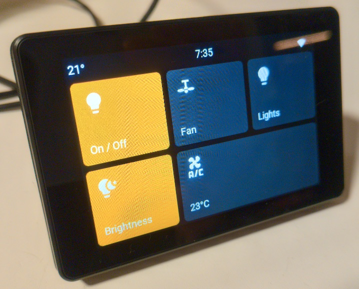
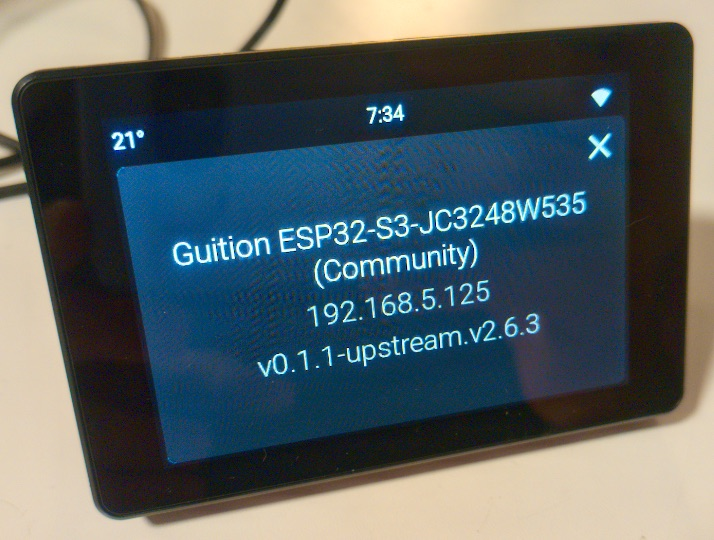

# Espcontrol Community Supported Devices

**Unofficial** community-maintained device configurations for
[EspControl](https://github.com/jtenniswood/espcontrol).

This repository is **not** maintained by or affiliated with the upstream project.
It provides additional device support for hardware that upstream has declined to
officially include (upstream only supports panels the maintainer can personally
test — a policy this repo works with, not around).

**📖 Documentation & installer: [lamiskin.github.io/espcontrol-community-devices](https://lamiskin.github.io/espcontrol-community-devices/)**

The community build running on a hardware-verified Guition JC3248W535:

| | |
|:--:|:--:|
|  |  |

## Supported devices

<!-- BEGIN GENERATED DEVICE LIST -->
<!-- Generated by community/scripts/generate_docs.py — edit community/STATUS.md instead. -->

| Device | Size | Resolution | Cards | Processor | Status |
|---|---|---|---|---|---|
| [Guition ESP32-S3-JC3248W535](https://lamiskin.github.io/espcontrol-community-devices/screens/guition-esp32-s3-jc3248w535) | 3.5 inches | 480 x 320 | 6 | ESP32-S3 | Working |
| [Seeed reTerminal D1001](https://lamiskin.github.io/espcontrol-community-devices/screens/seeed-esp32-p4-reterminal-d1001) | 8 inches | 1280 x 800 | 20 | ESP32-P4 | Untested |
| [Seeed SenseCAP Indicator D1](https://lamiskin.github.io/espcontrol-community-devices/screens/seeed-sensecap-indicator-d1) | 4 inches | 480 x 480 | 9 | ESP32-S3 | Working |
| [Tuya T3E Smart Panel](https://lamiskin.github.io/espcontrol-community-devices/screens/tuya-t3e) | 4 inches | 480 x 480 | 9 | ESP32-S3 | Untested |
| [Waveshare ESP32-P4-WIFI6-Touch-LCD-10.1](https://lamiskin.github.io/espcontrol-community-devices/screens/waveshare-esp32-p4-touch-lcd-10) | 10.1 inches | 1280 x 800 | 20 | ESP32-P4 | Untested |
| [Waveshare ESP32-S3-Touch-LCD-4](https://lamiskin.github.io/espcontrol-community-devices/screens/waveshare-esp32-s3-touch-lcd-4) | 4 inches | 480 x 480 | 9 | ESP32-S3 | Untested |
| [Wireless-Tag WT32-SC01 Plus](https://lamiskin.github.io/espcontrol-community-devices/screens/wireless-tag-wt32-sc01-plus) | 3.5 inches | 480 x 320 | 6 | ESP32-S3 | Untested |

<!-- END GENERATED DEVICE LIST -->

Devices marked **Working** are hardware-verified; **Untested** devices compile
at the current pin and are flashable but await verification by someone with the
hardware — if that's you, a photo/video of the panel running is all it takes to
promote one. Every device is compiled nightly, and one that stops compiling is
marked **Broken** and pulled from the installer automatically.

[community/STATUS.md](community/STATUS.md) carries the same list plus per-device
owner and source, the status definitions, and any **Parked** devices (config not
in the repo yet — not built, not installable).

## Install

**Browser (recommended):** open your device's page on the
[docs site](https://lamiskin.github.io/espcontrol-community-devices/),
connect the panel via USB, and click Install. Firmware updates after that are
over-the-air.

**ESPHome dashboard:** after flashing, the device can be adopted in the ESPHome
dashboard like any official EspControl panel — the generated config compiles
as-is. To build manually instead, copy `devices/<slug>/esphome.yaml`, set your
device name and WiFi secrets, and `esphome run` it.

## How it works

This is a thin overlay on upstream, pinned to an upstream release
(`community/upstream-ref.txt`):

- Device configs pull upstream's shared YAML via ESPHome remote packages at the
  pin; the espcontrol components come from upstream's repo the same way.
- The few upstream files that device configs must resolve locally are vendored
  byte-identical under `common/` (checksum-checked in CI against the pin).
- Firmware, the web configurator, and OTA update manifests are built in CI and
  served from this repo's GitHub Pages — devices never depend on upstream's
  hosting.
- Pin bumps arrive as automated PRs that must compile every device before
  merging, so installs only ever reference tested states.

## Contributing

- **New device:** see
  [community/docs/adding-a-device.md](community/docs/adding-a-device.md).
  ESP32-S3/P4 class panels only (see
  [community/DEVICES_POLICY.md](community/DEVICES_POLICY.md)).
- **Request a device:** open a
  [device request](https://github.com/lamiskin/espcontrol-community-devices/issues/new/choose).
- **Own an Untested device?** Flash it from the installer and report — hardware
  verification is the most valuable contribution here.

## License

Licensed under the same terms as upstream — see [LICENSE](LICENSE) and
[NOTICE](NOTICE). Device ports retain credit to their original authors in
[community/STATUS.md](community/STATUS.md).
